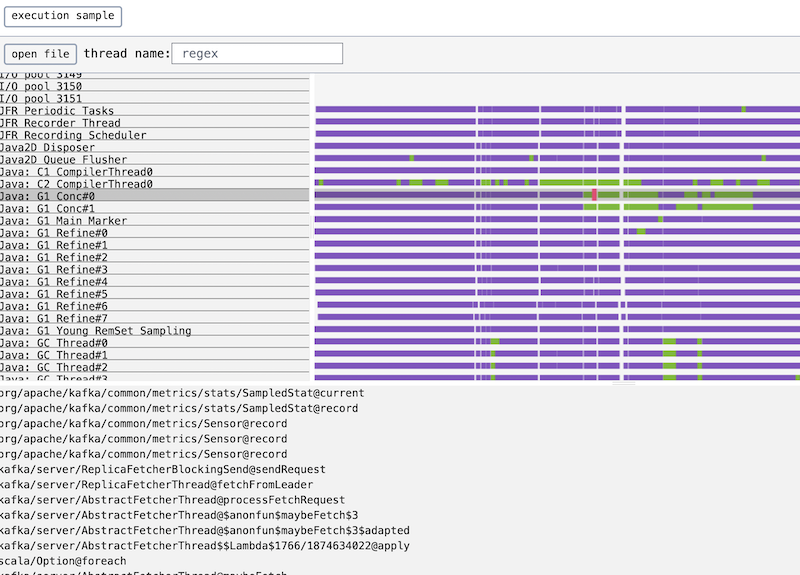

# jfrv

Yet another Java Flight Recorder file viewer

## Features

- Visualize execution samples
  * In async-profiler, corresponds to `cpu` and `wallclock` profiles

## Motivation

There are various profiling tools for Java applications.
Most widely used ones seem [Java Flight Recorder](https://openjdk.org/jeps/328) (JFR) and [async-profiler](https://github.com/jvm-profiling-tools/async-profiler).

Though both aim to be low-overhead so that can be run on production environment, in my experience, async-profiler is
much efficient and safe to run even against high-load streaming middleware (like Kafka) without notable impact.

async-profiler supports output profiles in JFR-compatible format which contains per-thread samples with stacktrace
when the sample was recorded, so we can use it to check very detailed threads timeline that greatly helps to investigate
performance issues (particularly when the issue is due to contention between the threads).

However, existing JFR viewers seem to be not suitable for visualizing async-profiler-recorded files so I needed another tool to
generate threads timeline.

## Runs on browsers

jfrv parses JFR files 100% on browsers using wasm-compiled Rust JFR reader [jfrs](https://github.com/ocadaruma/jfrs).
